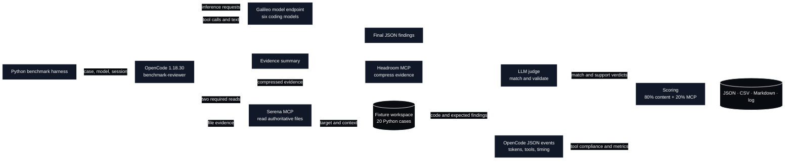

# OpenCode Agent Benchmark Review

## Scope and evidence limits

Reviewed artifacts:

- `results/opencode-agent/opencode-agent-results.json`
- `results/opencode-agent/opencode-agent-results.csv`
- `results/opencode-agent/opencode-agent-results.md`
- `logs/opencode-agent-results.log`

This result set contains:

- **6 models**
- **20 cases per model**
- **120 attempted cases**
- **115 valid completions**
- **5 failures**
- One **continuing session per model**
- OpenCode `1.18.30`
- 360-second case timeout
- Eight-agent-step limit
- Serena and Headroom as the only permitted tools

**Important:** despite the updated runner now supporting fresh and continuing modes, these artifacts are from the earlier **continuing-session-only run**. They contain neither `session_mode` nor `summaries_by_session_mode`. Therefore, no fresh-versus-continuing comparison can honestly be made from these files.

## Test environment and dataflow

### Environment

The benchmark used a local controller to run OpenCode against remotely hosted Galileo coding models while keeping repository inspection, evidence compression, and result processing in the agent workflow.

| Layer | Recorded or configured environment |
|---|---|
| Controller | macOS workstation running the Python benchmark harness from `~/llm-test-bench` |
| Agent runtime | OpenCode `1.18.30`, invoked non-interactively with `opencode run --pure --format json` |
| Agent | `benchmark-reviewer`, limited to eight steps per case |
| Tested models | Six `galileo/*:LATEST` coding-model aliases |
| Model provider | OpenAI-compatible Galileo provider configured at `http://<llama-server>:8080/v1` |
| Benchmark corpus | Twenty deterministic Python review fixtures: ten code-quality cases followed by ten defensive-security cases |
| Fixture workspace | `opencode-agent-suite/workspaces/review-project` |
| Serena MCP | Local MCP process, explicitly rooted at the fixture workspace; used to read `target.py` and `project_context.md` |
| Headroom MCP | Local `headroom mcp serve` process; used once per case to compress the evidence summary |
| Judge | Separate OpenAI-compatible judge client used to match expected findings and validate whether reported findings were supported |
| Session policy | One continuing OpenCode session per model across all twenty cases |
| Context policy | Auto-compaction enabled; 8,000 recent tokens preserved and 32,768 tokens reserved, as recorded in the result configuration |
| Timeout | 360 seconds per OpenCode case, followed by process-group termination on timeout |
| Tool policy | External plugins disabled through `--pure`; only `serena_read_file` and `headroom_headroom_compress` allowed to the benchmark agent |
| Scoring | Content F1 weighted at 80%; required-tool compliance weighted at 20% |
| Persistence | Raw OpenCode JSON events parsed into resumable JSON, flat CSV, Markdown, and append-only logs |

The result artifacts record the benchmark configuration but do not record the controller’s Python version, resolved model hashes behind `LATEST`, sampling seed, resolved judge endpoint, judge artifact hash, Serena version, or Headroom version. The configured provider and default judge endpoints describe the inspected benchmark setup; environment-variable overrides were not persisted, so this report cannot prove that none were active during the run.

### Dataflow



For each case, the harness started or resumed the model’s OpenCode session. The model first used Serena to read the target and project context, constructed an evidence summary, sent that summary through Headroom, and then generated structured findings. OpenCode emitted JSON events containing text, tool state, session identity, token accounting, and timing. The judge compared the final findings with the case’s expected findings and separately checked whether each candidate was supported by the source code. The harness combined content F1 and successful-tool compliance, then persisted the case and aggregate results.

The scoring judge operated after the timed OpenCode turn. Consequently, `elapsed_seconds` and the derived agent E2E throughput describe the OpenCode agent workflow, not judge latency or complete benchmark wall time.

## 1. Aggregate result table

“Successful content” is a derived diagnostic: content score after excluding failed cases. It is useful for separating review capability from agent reliability, but it is not the official ranking score.

“Agent E2E t/s” is derived as total output tokens divided by summed agent elapsed time. It includes all OpenCode model turns and tool orchestration, not merely native Galileo decoding.

| Rank | Model | Overall | Content | Successful content | Quality | Security | MCP | Valid | Mean sec | Agent E2E t/s |
|---:|---|---:|---:|---:|---:|---:|---:|---:|---:|---:|
| 1 | Qwen3.6 35B MTP | **87.87** | **84.83** | 84.83 | 73.67 | **96.00** | 100.00 | 20/20 | 150.29 | **16.25** |
| 2 | Gemma4 26B A4B | 86.91 | 83.64 | 83.64 | **74.28** | 93.00 | 100.00 | 20/20 | 53.99 | 13.01 |
| 3 | Qwen3 Coder Next | 85.40 | 81.75 | 81.75 | 72.49 | 91.00 | 100.00 | 20/20 | **44.84** | 11.86 |
| 4 | Laguna XS 2.1 | 80.40 | 75.50 | 75.50 | 60.00 | 91.00 | 100.00 | 20/20 | 78.65 | 16.04 |
| 5 | Ornith | 66.47 | 64.33 | **85.78** | 45.67 | 83.00 | 75.00 | 15/20 | 194.48 | 13.20 |
| 6 | North Mini Code | 62.73 | 53.41 | 53.41 | 61.29 | 45.52 | 100.00 | 20/20 | 139.92 | 11.80 |

The aggregate values in `Overall`, `Content`, `Quality`, `Security`, `MCP`, and `Mean sec` are from the generated benchmark report. `Successful content` and `Agent E2E t/s` are derived from the raw case rows.

### Accuracy profile

| Model | Recall | Precision | Unsupported findings | Total output tokens | Total cache-read tokens |
|---|---:|---:|---:|---:|---:|
| Gemma4 26B A4B | 77.08% | 97.50% | 1 | 14,049 | 1,932,242 |
| Ornith | 59.17% overall / 78.89% valid only | 75.00% overall / 100% valid only | 0 | 51,325 | 2,804,385 |
| Qwen3.6 35B MTP | 77.50% | **100.00%** | 0 | 48,845 | 2,956,237 |
| Laguna XS 2.1 | 66.67% | **100.00%** | 0 | 25,233 | 2,146,285 |
| North Mini Code | 65.42% | **60.17%** | **46** | 33,019 | 1,948,945 |
| Qwen3 Coder Next | 75.83% | 94.17% | 3 | **10,633** | **1,249,532** |

The benchmark processed, in aggregate:

- **248,192 input tokens**
- **183,104 output tokens**
- **13,037,626 cache-read tokens**
- **13,243.4 seconds** of recorded agent execution
- **50 unsupported findings**

These token counts are summed over multiple model turns within each case. Cache-read totals are therefore not unique tokens.

## 2. Case-level content results

`FAIL` means the agent run was assigned zero because it timed out or did not complete the required workflow.

| Case | Gemma | Ornith | Qwen3.6 | Laguna | North | Qwen Coder Next |
|---|---:|---:|---:|---:|---:|---:|
| quality-01 | 80.00 | 80.00 | 80.00 | 80.00 | 50.00 | 80.00 |
| quality-02 | 100.00 | 100.00 | 50.00 | 50.00 | 80.00 | 44.44 |
| quality-03 | 80.00 | 80.00 | 80.00 | 50.00 | 72.73 | 66.67 |
| quality-04 | 50.00 | 50.00 | 100.00 | 80.00 | 0.00 | 100.00 |
| quality-05 | 80.00 | FAIL | 80.00 | 80.00 | 72.73 | 80.00 |
| quality-06 | 80.00 | 80.00 | 80.00 | 80.00 | 50.00 | 57.14 |
| quality-07 | 80.00 | FAIL | 100.00 | 80.00 | 80.00 | 80.00 |
| quality-08 | 57.14 | FAIL | 50.00 | 50.00 | 50.00 | 100.00 |
| quality-09 | 50.00 | FAIL | 50.00 | 50.00 | 80.00 | 50.00 |
| quality-10 | 85.71 | 66.67 | 66.67 | 0.00 | 77.42 | 66.67 |
| security-01 | 100.00 | 100.00 | 100.00 | 100.00 | 66.67 | 100.00 |
| security-02 | 100.00 | 100.00 | 100.00 | 100.00 | 66.67 | 100.00 |
| security-03 | 80.00 | 100.00 | 80.00 | 100.00 | 66.67 | 100.00 |
| security-04 | 100.00 | 100.00 | 100.00 | 80.00 | 0.00 | 80.00 |
| security-05 | 100.00 | 100.00 | 100.00 | 100.00 | 66.67 | 100.00 |
| security-06 | 100.00 | FAIL | 100.00 | 100.00 | 26.67 | 100.00 |
| security-07 | 50.00 | 80.00 | 100.00 | 50.00 | 33.33 | 50.00 |
| security-08 | 100.00 | 100.00 | 100.00 | 100.00 | 66.67 | 100.00 |
| security-09 | 100.00 | 50.00 | 80.00 | 80.00 | 33.33 | 80.00 |
| security-10 | 100.00 | 100.00 | 100.00 | 100.00 | 28.57 | 100.00 |

### Case difficulty observed in this run

Hardest cases by mean content score:

| Case | Mean content | Failures |
|---|---:|---:|
| quality-09 | **46.67** | 1 |
| quality-08 | 51.19 | 1 |
| security-07 | 60.55 | 0 |
| quality-10 | 60.52 | 0 |
| quality-04 | 63.33 | 0 |
| quality-05 | 65.45 | 1 |

Easiest cases:

| Case | Mean content |
|---|---:|
| security-01 | 94.44 |
| security-02 | 94.44 |
| security-05 | 94.44 |
| security-08 | 94.44 |
| security-10 | 88.10 |

This shows that the security suite’s high aggregate score was partly driven by several cases that almost every model solved. It does not, by itself, prove that security reasoning is inherently easier than quality review.

## 3. What happened

### Qwen3.6 35B MTP: highest score, high cost

Qwen3.6 ranked first:

- 87.87 overall
- 84.83 content
- 96.00 security
- 100% MCP compliance
- No unsupported findings
- No failed cases

Its principal weakness was operational cost:

- 150.29 seconds per case
- Approximately **2.78× Gemma’s mean latency**
- Approximately **3.35× Qwen Coder Next’s mean latency**
- 48,845 output tokens, versus 14,049 for Gemma and 10,633 for Qwen Coder Next

Its continuing context grew from 14,470 cache-read tokens on its first case to 254,760 on its final case. Its first-five average per-case E2E rate was approximately 18.95 t/s; the last-five average was approximately 13.27 t/s.

That is an observed decline. The correlation between cache-read volume and case E2E throughput was **−0.837**. Correlation is not proof that context size alone caused the decrease, because output length and case content also changed.

### Gemma: nearly the best score with much lower latency

Gemma was only 0.96 points behind Qwen3.6:

- 86.91 overall
- 83.64 content
- Best quality aggregate: 74.28
- 93.00 security
- 100% MCP compliance
- No failures
- Only one unsupported finding

Operationally:

- 53.99 seconds per case
- 14,049 output tokens
- 13.01 agent E2E t/s

Gemma was substantially more efficient than Qwen3.6 in elapsed time and generated tokens while achieving nearly the same content score.

Its weakest cases were:

- `quality-04`: 50
- `quality-09`: 50
- `security-07`: 50
- `quality-08`: 57.14

Its cache-read count increased from 22,598 to 165,294. The correlation between cache volume and E2E throughput was **−0.928**, and average rate declined from approximately 14.62 t/s over its first five cases to 11.29 over its final five.

### Qwen Coder Next: fastest complete model

Qwen Coder Next had:

- 85.40 overall
- 81.75 content
- 91.00 security
- 100% MCP compliance
- No failures
- 44.84 seconds per case, the fastest mean
- Only 10,633 output tokens, the lowest total

This is the strongest latency/quality trade-off in the completed run. It scored only 2.47 points below the overall winner while taking less than one-third of Qwen3.6’s mean case time.

Its derived E2E token rate was only 11.86 t/s because it produced much shorter answers. This demonstrates why E2E t/s must not be interpreted as task latency: lower token generation can make a model finish faster even when its token rate is lower.

### Laguna: reliable but weaker on quality review

Laguna completed every case and followed the required workflow:

- 80.40 overall
- 75.50 content
- 60.00 quality
- 91.00 security
- 100% MCP compliance
- No unsupported findings
- 16.04 agent E2E t/s

Its central weakness was quality-case recall. It scored zero content on `quality-10` and 50 on four other quality cases.

A major timing anomaly occurred on `security-09`:

- 50,618 input tokens
- 1,386 output tokens
- 145,933 cache-read tokens
- 299.27 seconds

The next case dropped to 1,062 input and 50,846 cache-read tokens, completing in 44.55 seconds.

That pattern is **consistent with a context compaction/rewrite**, and auto-compaction was enabled. However, the result and log do not explicitly record a compaction event, so it cannot be proven from these artifacts alone.

### Ornith: strong conditional quality, poor agent reliability

The aggregate ranking materially understates Ornith’s review quality when it actually completed:

- Published content score: 64.33
- Content score on its 15 valid cases: **85.78**
- Precision on valid cases: **100%**
- Five failed cases
- No unsupported findings

On successfully completed cases, Ornith’s 85.78 content score was higher than every other model’s aggregate content score. But it failed 25% of the workflow:

| Case | Failure |
|---|---|
| quality-05 | Timed out after 360 seconds; no parsed output or tools |
| quality-07 | Produced a substantive response but called Headroom without Serena |
| quality-08 | Timed out after 360 seconds; no parsed output or tools |
| quality-09 | Read both files, then timed out before Headroom/final answer |
| security-06 | Completed Serena and Headroom, then timed out before a valid final answer |

These were different failure modes, not five identical MCP failures.

Therefore:

- **As a review model conditional on completion:** Ornith was highly capable.
- **As an agent under a 360-second SLA:** Ornith was unreliable.
- The result artifacts do not establish whether the stalls originated in model inference, OpenCode orchestration, server availability, or host conditions.

There were no explicit tool errors, but that does not prove the MCP infrastructure was healthy: two timeout rows contained no parsed event data at all.

### North Mini Code: follows tools, but content is unreliable

North completed all 20 workflows and achieved 100% MCP compliance. Its content result was nevertheless the weakest:

- 53.41 content
- 45.52 security
- 60.17% precision
- **46 unsupported findings**
- Zero content on `quality-04` and `security-04`

This is important: tool compliance did not imply correct analysis. North consistently read the requested files and used Headroom, but frequently added findings that the judge considered unsupported.

Examples of security degradation include:

- `security-04`: 0
- `security-06`: 26.67
- `security-10`: 28.57
- `security-07`: 33.33
- `security-09`: 33.33

The benchmark’s binary MCP component gives North the same 100-point tool score as Qwen3.6, despite their very different final-answer quality.

## 4. Factors that affected the results

### A. Failures are included as zero scores

This had the largest visible effect on Ornith.

The official aggregate averages all 20 rows, including five zero-score failures. That reduces Ornith from 85.78 content on valid completions to 64.33 overall content.

This is defensible if the benchmark is measuring production agent reliability, but it mixes two dimensions:

1. Can the model identify the defects?
2. Can the model complete the constrained tool workflow within 360 seconds?

Those should be reported separately, even if a combined score is retained.

### B. Fixed 80/20 scoring weights

Overall score is:

```text
0.8 × content F1 + 0.2 × MCP compliance
```

The content score itself is F1 over expected-finding recall and supported-finding precision.

Consequences:

- A content score of zero still produces an overall 20 if tool compliance is 100.
- North’s `quality-04` and `security-04` received 20 overall despite zero content.
- Most models saturated the MCP score at 100, so MCP did not distinguish the top four models.
- Ornith’s invalid workflows were hard-zeroed rather than receiving partial credit for individual successful calls.

### C. Continuing-session context growth

All 20 cases for a model reused one session. Cache-read volume generally grew throughout each model’s run.

Observed correlation between cache-read tokens and E2E throughput:

| Model | Correlation |
|---|---:|
| Gemma | −0.928 |
| Ornith, valid cases | −0.947 |
| Qwen3.6 | −0.837 |
| Laguna | −0.705 |
| North | −0.498 |
| Qwen Coder Next | −0.148 |

These are associations, not causal estimates. The continuing context changed at the same time as:

- Case identity
- Category
- Answer length
- Tool payload size
- Possible compaction
- Server conditions

A fresh-session run is needed to isolate cross-case context accumulation.

### D. Quality always ran before security

Every model processed:

1. `quality-01` through `quality-10`
2. `security-01` through `security-10`

This creates a confound:

- Category changed from quality to security.
- Context length also increased.
- The model had already seen ten examples of the required response format.
- Security cases in this suite were generally easier according to cross-model means.

Therefore, the higher security scores cannot be attributed solely to superior security capability or later-session learning.

### E. Case difficulty was uneven

Several expected findings were missed by all six models:

- `missing typing`: missed 6/6
- `dependency definition`: missed 6/6
- `ambiguous ordering`: missed 6/6
- `shallow copy`: missed 6/6

Others were found by only one model:

- `incorrect cache key`
- `batch data processing`
- `blocking sleep`
- `claim validation`

This may mean those findings are genuinely difficult, less salient under the prompt, or judged more strictly. The artifacts alone cannot determine which explanation is correct.

### F. Output verbosity materially affected latency

Output totals varied from 10,633 to 51,325 tokens.

Examples:

- Qwen Coder Next generated the least output and finished fastest.
- Qwen3.6 generated 4.6× as many output tokens and took 3.35× longer per case.
- Ornith generated the most output and had multiple timeouts.
- Gemma generated compact answers with nearly top accuracy.

This supports an association between verbosity and elapsed time. It does not prove verbosity was the only cause of the slower runs because context processing and model speed also differ.

### G. The benchmark experienced large timing discontinuities

Recorded agent elapsed time totaled:

```text
3 h 40 m 43 s
```

The execution log spans:

```text
6 h 09 m 03 s
```

Three particularly large wall-clock versus recorded-elapsed discrepancies were present:

- Qwen3.6 `security-05`: approximately 679 seconds
- North `quality-02`: approximately 1,025 seconds
- North `security-08`: approximately 5,022 seconds

For example, North `security-08` started at 20:17:38 and finished at 21:47:15, but the result reports only 355.34 elapsed seconds.

The files do **not** identify the cause. Host sleep, a wall-clock adjustment, or a mismatch in timing sources are possible explanations, but asserting one would be speculation.

There were also unusually long post-agent scoring gaps:

- North `quality-02`: 476 seconds
- North `security-07`: 638 seconds

These occurred after OpenCode finished and before “Case scored,” so they did not affect the model’s recorded `elapsed_seconds`, but they did affect total benchmark duration. The old artifacts do not contain a dedicated judge-latency field.

### H. One trial per model/case

There is one observation for every model/case pair. The report contains no:

- Replicate runs
- Variance
- Confidence intervals
- Recorded random seed
- Sampling parameters
- Model artifact hashes

Consequently, the 0.96-point difference between Qwen3.6 and Gemma is an observed difference, not evidence of a stable statistical ordering.

### I. LLM judge dependence

The score relies on a judge to determine:

- Whether a proposed finding matches an expected finding.
- Whether a proposed finding is supported by the code.

The benchmark treats both `yes` and `partial` as positive.

This reduces brittle keyword dependence, but introduces judge dependence. The result files do not include:

- Raw judge prompts and verdicts
- Judge agreement measurements
- Human validation
- Alternative-judge comparisons

Therefore, judge noise or bias cannot be quantified from this run.

## 5. What should be improved

### Priority 1: run the new fresh and continuing modes

This is the most important next experiment.

Report separately:

- Fresh-session content and latency
- Continuing-session content and latency
- Native Galileo generation rate
- Agent E2E rate
- Completion rate under the SLA

The existing artifacts cannot isolate context-growth effects.

### Priority 2: separate capability from reliability

Every model summary should contain at least:

| Dimension | Meaning |
|---|---|
| Attempt completion rate | Valid answers / attempted cases |
| Successful-case content | Review quality conditional on completion |
| Failure-adjusted content | Current all-case aggregate |
| Tool workflow completion | Successful required workflow |
| Timeout rate | Operational reliability |
| Invalid-answer rate | Completed process but unusable output |

For Ornith, this would immediately expose:

```text
Completion:          75%
Successful content: 85.78
Failure-adjusted:    64.33
```

The current `completed_cases=20` label is misleading for Ornith because five rows failed. It should be called `attempted_cases`.

### Priority 3: repeat and counterbalance

Run at least several repetitions per model/case and report:

- Mean
- Median
- Standard deviation
- Confidence interval
- Completion rate

For continuing sessions, use multiple seeded case orders. In particular:

- Do not always place quality before security.
- Counterbalance category order.
- Interleave models by case to reduce time-of-day/server-condition confounding.
- Preserve a separately controlled fixed-order benchmark for reproducibility.

Without repetitions, small score differences should not drive model selection.

### Priority 4: instrument every latency component

Record independently:

- OpenCode process startup
- Provider/model loading
- Prompt processing
- Native generation
- Serena latency
- Headroom latency
- Final-answer generation
- Judge latency
- Report-writing latency
- Wall-clock duration
- Monotonic duration
- Clock-drift/suspension discrepancy

The three large timestamp discontinuities should automatically trigger a data-quality warning.

If host suspension is later confirmed, running under macOS `caffeinate` would be appropriate. It should not be prescribed as the root-cause fix until suspension is actually confirmed.

### Priority 5: improve tool-compliance scoring

The current compliance check mostly measures whether two tool names completed. It should distinguish:

1. Serena read the correct target.
2. Serena read the correct context file.
3. Both calls succeeded.
4. Headroom was called exactly once.
5. Headroom received evidence grounded in the Serena output.
6. The final answer remained grounded in the inspected files.
7. No forbidden tool or unnecessary discovery was attempted.

A graded compliance score would be more informative than the current near-universal 100.

### Priority 6: control verbosity

The prompt should constrain findings and response size more explicitly, for example:

- Maximum number of findings
- Findings ordered by severity/confidence
- No duplicate symptoms of one root cause
- Fixed field lengths or token budget
- Stop after all high-confidence expected root causes are covered

This is especially relevant for Ornith and Qwen3.6, which generated much more output.

The goal should not be simply “shorter output”; it should be **higher supported-finding density per generated token**.

### Priority 7: improve timeout interpretation

Retain the 360-second production SLA, but report two views:

- **SLA score:** timeout equals failure.
- **Capability score:** valid completed cases only.

Optionally run a separate diagnostic with a longer timeout for models that failed. That would establish whether the model eventually completes or is stuck indefinitely, without changing the production ranking.

### Priority 8: audit the gold findings and judge

Review the findings missed by all six models:

- Are they sufficiently important to deserve equal weight?
- Are they clearly evidenced in the target?
- Does the review prompt ask for that dimension?
- Does the judge consistently recognize equivalent wording?
- Are expected findings independent root causes, or overlapping manifestations?

Do not remove them merely because models missed them. First validate them with blinded human review and judge-verdict inspection.

### Priority 9: record reproducibility metadata

Persist:

- Exact Galileo server build
- Model manifest/hash, not just `LATEST`
- Quantization
- Context size
- Sampling parameters
- Seed
- KV-cache configuration
- OpenCode configuration hash
- Prompt hash
- Serena/Headroom versions
- Judge model hash and parameters
- Host sleep/clock events where available

`LATEST` aliases can change and make later runs non-comparable.

### Priority 10: improve report semantics

The report should clearly label:

- `attempted_cases`
- `valid_cases`
- `failed_cases`
- `timeout_cases`
- `invalid_workflow_cases`
- `successful_case_content`
- `failure_adjusted_content`
- `agent_e2e_tokens_per_second`
- `native_generation_tokens_per_second`
- `judge_seconds`
- `total_benchmark_wall_seconds`

This avoids conflating decoding speed, agent throughput, and total experiment duration.

## Overall assessment

### Neutral view

The benchmark successfully distinguishes three dimensions:

- Review quality
- Required-tool compliance
- Operational completion

Qwen3.6 had the highest failure-adjusted score. Gemma was nearly as accurate with substantially lower latency. Qwen Coder Next had the best complete-run latency. Ornith showed top-tier conditional review quality but unacceptable reliability under the configured timeout. North followed the workflow but produced many unsupported findings.

### Devil’s-advocate view

The exact ranking is less robust than the table suggests:

- Only one trial was run.
- All cases used continuing sessions.
- Category and context position were confounded.
- Most models saturated MCP scoring.
- An LLM judge determined correctness.
- Large timing discontinuities occurred.
- The top two models differed by less than one point.
- `LATEST` model aliases weaken reproducibility.

Therefore, selecting Qwen3.6 as categorically “best” would overstate what this run proves.

### Positive view

The result set is still decision-useful:

- **Best observed score:** Qwen3.6
- **Best quality/latency balance:** Gemma
- **Fastest complete model:** Qwen Coder Next
- **Highest conditional content quality but unreliable:** Ornith
- **Reliable middle tier:** Laguna
- **Needs grounding/precision improvement:** North

The new fresh/continuing runner design directly addresses the largest experimental limitation. The next controlled dual-mode, repeated run should produce a much more defensible model-selection result.

# Appendix A — Quality tasks

The explanations below follow the scorer mechanically. A model achieved full content success when the judge matched every expected finding and found no unsupported candidate. A partial result identifies the exact matched expectations, missed expectations, and unsupported count. An operational failure records the harness error rather than inferring a hidden model-internal cause.

A low content score does not necessarily mean that every statement in the answer was false. Recall measures coverage of the benchmark’s named expectations, while precision measures the share of candidate findings judged to be supported by the code. Consequently, an answer can have 100% precision and 0% recall when it reports supported observations that do not match any expected finding.

## A.1 `quality-01`

**Target code**

```python
def load_names(path):
    file = open(path)
    return [line.strip() for line in file.readlines() if line.strip()]
```

**Expected findings:** `resource management`, `unnecessary materialization`, `missing typing`.

| Model | Content | Recall | Precision | Evidence-based outcome |
|---|---:|---:|---:|---|
| Gemma | 80.00 | 66.67% | 100.00% | Partial: matched resource management and unnecessary materialization; missed missing typing; unsupported=0. |
| Ornith | 80.00 | 66.67% | 100.00% | Partial: matched resource management and unnecessary materialization; missed missing typing; unsupported=0. |
| Qwen3.6 | 80.00 | 66.67% | 100.00% | Partial: matched resource management and unnecessary materialization; missed missing typing; unsupported=0. |
| Laguna | 80.00 | 66.67% | 100.00% | Partial: matched resource management and unnecessary materialization; missed missing typing; unsupported=0. |
| North | 50.00 | 33.33% | 100.00% | Partial: matched resource management; missed unnecessary materialization and missing typing; unsupported=0. |
| Qwen Coder Next | 80.00 | 66.67% | 100.00% | Partial: matched resource management and unnecessary materialization; missed missing typing; unsupported=0. |

**Why models succeeded or lost credit:** five models recognized both the open-file lifecycle and the unnecessary `readlines()` materialization. North received less recall because only resource management matched. Every model missed the benchmark’s missing-typing expectation, so no model obtained full credit. These statements describe judge matches; they do not identify why the models omitted typing.

## A.2 `quality-02`

**Target code**

```python
def calculate_total(items):
    total = 0
    for item in items:
        if item["active"] == True:
            total = total + float(item["price"]) * int(item["quantity"])
    return round(total, 2)
```

**Expected findings:** `money precision`, `boolean comparison`, `data validation`.

| Model | Content | Recall | Precision | Evidence-based outcome |
|---|---:|---:|---:|---|
| Gemma | 100.00 | 100.00% | 100.00% | Full success: matched all expected findings; unsupported=0. |
| Ornith | 100.00 | 100.00% | 100.00% | Full success: matched all expected findings; unsupported=0. |
| Qwen3.6 | 50.00 | 33.33% | 100.00% | Matched data validation; missed money precision and boolean comparison; unsupported=0. |
| Laguna | 50.00 | 33.33% | 100.00% | Matched boolean comparison; missed money precision and data validation; unsupported=0. |
| North | 80.00 | 66.67% | 100.00% | Matched boolean comparison and data validation; missed money precision; unsupported=0. |
| Qwen Coder Next | 44.44 | 33.33% | 66.67% | Matched data validation; missed money precision and boolean comparison; unsupported=1. |

**Why models succeeded or lost credit:** Gemma and Ornith covered all three scoring targets without unsupported additions. North omitted the money-precision target. Qwen3.6 and Qwen Coder Next matched only validation; Qwen Coder Next also had one unsupported candidate, reducing precision. Laguna matched only the boolean-comparison target.

## A.3 `quality-03`

**Target code**

```python
class UserService:
    def create(self, data):
        user = self.db.insert(data)
        self.mailer.send(data["email"], "welcome")
        self.analytics.track("created", user.id)
        return user
```

**Expected findings:** `partial failure consistency`, `dependency definition`, `mixed responsibilities`.

| Model | Content | Recall | Precision | Evidence-based outcome |
|---|---:|---:|---:|---|
| Gemma | 80.00 | 66.67% | 100.00% | Matched partial failure consistency and mixed responsibilities; missed dependency definition; unsupported=0. |
| Ornith | 80.00 | 66.67% | 100.00% | Matched partial failure consistency and mixed responsibilities; missed dependency definition; unsupported=0. |
| Qwen3.6 | 80.00 | 66.67% | 100.00% | Matched partial failure consistency and mixed responsibilities; missed dependency definition; unsupported=0. |
| Laguna | 50.00 | 33.33% | 100.00% | Matched partial failure consistency; missed dependency definition and mixed responsibilities; unsupported=0. |
| North | 72.73 | 66.67% | 80.00% | Matched partial failure consistency and mixed responsibilities; missed dependency definition; unsupported=1. |
| Qwen Coder Next | 66.67 | 66.67% | 66.67% | Matched partial failure consistency and mixed responsibilities; missed dependency definition; unsupported=1. |

**Why models succeeded or lost credit:** all six models matched the partial-failure risk. Five also matched mixed responsibilities. None matched dependency definition, preventing full recall. North and Qwen Coder Next added one unsupported finding each, so their precision and F1 fell below models with the same recall and no unsupported additions.

## A.4 `quality-04`

**Target code**

```python
async def fetch_all(urls, session):
    results = []
    for url in urls:
        response = await session.get(url)
        results.append(await response.json())
    return results
```

**Expected findings:** `sequential async IO`, `response lifecycle`, `bounded concurrency`.

| Model | Content | Recall | Precision | Evidence-based outcome |
|---|---:|---:|---:|---|
| Gemma | 50.00 | 33.33% | 100.00% | Matched sequential async IO; missed response lifecycle and bounded concurrency; unsupported=0. |
| Ornith | 50.00 | 33.33% | 100.00% | Matched sequential async IO; missed response lifecycle and bounded concurrency; unsupported=0. |
| Qwen3.6 | 100.00 | 100.00% | 100.00% | Full success: matched all expected findings; unsupported=0. |
| Laguna | 80.00 | 66.67% | 100.00% | Matched sequential async IO and response lifecycle; missed bounded concurrency; unsupported=0. |
| North | 0.00 | 0.00% | 100.00% | Matched none of the expected findings; missed all three; unsupported=0; required MCP workflow completed. |
| Qwen Coder Next | 100.00 | 100.00% | 100.00% | Full success: matched all expected findings; unsupported=0. |

**Why models succeeded or lost credit:** Qwen3.6 and Qwen Coder Next covered concurrency, response lifecycle, and sequential execution. Laguna omitted bounded concurrency. Gemma and Ornith matched only sequential execution. North’s candidates were judged supported, producing 100% precision, but none matched the three benchmark expectations, producing 0% recall and a zero content score.

## A.5 `quality-05`

**Target code**

```python
def find_duplicates(values):
    duplicates = []
    for i in range(len(values)):
        for j in range(i + 1, len(values)):
            if values[i] == values[j] and values[i] not in duplicates:
                duplicates.append(values[i])
    return duplicates
```

**Expected findings:** `quadratic complexity`, `set-based algorithm`, `ambiguous ordering`.

| Model | Content | Recall | Precision | Evidence-based outcome |
|---|---:|---:|---:|---|
| Gemma | 80.00 | 66.67% | 100.00% | Matched quadratic complexity and set-based algorithm; missed ambiguous ordering; unsupported=0. |
| Ornith | 0.00 | 0.00% | 0.00% | Operational failure: exceeded 360 seconds and was terminated; no successful tools were parsed. |
| Qwen3.6 | 80.00 | 66.67% | 100.00% | Matched quadratic complexity and set-based algorithm; missed ambiguous ordering; unsupported=0. |
| Laguna | 80.00 | 66.67% | 100.00% | Matched quadratic complexity and set-based algorithm; missed ambiguous ordering; unsupported=0. |
| North | 72.73 | 66.67% | 80.00% | Matched quadratic complexity and set-based algorithm; missed ambiguous ordering; unsupported=1. |
| Qwen Coder Next | 80.00 | 66.67% | 100.00% | Matched quadratic complexity and set-based algorithm; missed ambiguous ordering; unsupported=0. |

**Why models succeeded or lost credit:** every valid answer found the quadratic algorithm and set-based remediation, while every valid answer missed ambiguous ordering. North’s additional unsupported candidate reduced precision. Ornith’s zero is operational rather than evidence of failed code analysis: the run timed out with no parsed tools or final response, and the artifacts do not identify the stall’s root cause.

## A.6 `quality-06`

**Target code**

```python
def parse_age(value):
    try:
        return int(value)
    except:
        return None
```

**Expected findings:** `bare exception`, `ambiguous failure`, `range validation`.

| Model | Content | Recall | Precision | Evidence-based outcome |
|---|---:|---:|---:|---|
| Gemma | 80.00 | 66.67% | 100.00% | Matched bare exception and ambiguous failure; missed range validation; unsupported=0. |
| Ornith | 80.00 | 66.67% | 100.00% | Matched bare exception and ambiguous failure; missed range validation; unsupported=0. |
| Qwen3.6 | 80.00 | 66.67% | 100.00% | Matched bare exception and ambiguous failure; missed range validation; unsupported=0. |
| Laguna | 80.00 | 66.67% | 100.00% | Matched bare exception and range validation; missed ambiguous failure; unsupported=0. |
| North | 50.00 | 66.67% | 40.00% | Matched bare exception and ambiguous failure; missed range validation; unsupported=3. |
| Qwen Coder Next | 57.14 | 66.67% | 50.00% | Matched bare exception and range validation; missed ambiguous failure; unsupported=1. |

**Why models succeeded or lost credit:** all models matched the bare exception. Gemma, Ornith, Qwen3.6, and North matched ambiguous failure but missed range validation; Laguna and Qwen Coder Next showed the opposite second match. The first four high-precision answers had no unsupported additions. North and Qwen Coder Next lost additional F1 through three and one unsupported candidates respectively.

## A.7 `quality-07`

**Target code**

```python
class Report:
    cache = {}
    def render(self, user_id, options={}):
        options["user_id"] = user_id
        if user_id not in self.cache:
            self.cache[user_id] = build_report(options)
        return self.cache[user_id]
```

**Expected findings:** `mutable default`, `shared class state`, `incorrect cache key`.

| Model | Content | Recall | Precision | Evidence-based outcome |
|---|---:|---:|---:|---|
| Gemma | 80.00 | 66.67% | 100.00% | Matched mutable default and shared class state; missed incorrect cache key; unsupported=0. |
| Ornith | 0.00 | 0.00% | 0.00% | Operational workflow failure: Headroom succeeded, but no successful Serena read was recorded. |
| Qwen3.6 | 100.00 | 100.00% | 100.00% | Full success: matched all expected findings; unsupported=0. |
| Laguna | 80.00 | 66.67% | 100.00% | Matched mutable default and shared class state; missed incorrect cache key; unsupported=0. |
| North | 80.00 | 66.67% | 100.00% | Matched mutable default and shared class state; missed incorrect cache key; unsupported=0. |
| Qwen Coder Next | 80.00 | 66.67% | 100.00% | Matched mutable default and shared class state; missed incorrect cache key; unsupported=0. |

**Why models succeeded or lost credit:** Qwen3.6 alone matched all three expectations. The other four valid workflows omitted incorrect cache key. Ornith generated a substantive response, but the benchmark correctly rejected the case because the mandatory Serena inspection was absent; the zero measures workflow invalidity, not an evaluated content miss.

## A.8 `quality-08`

**Target code**

```python
def save_config(config, path):
    path.write_text(json.dumps(config))
    path.rename(path.with_suffix(".active"))
```

**Expected findings:** `non-atomic update`, `serialization failure`, `encoding and durability`.

| Model | Content | Recall | Precision | Evidence-based outcome |
|---|---:|---:|---:|---|
| Gemma | 57.14 | 66.67% | 50.00% | Matched non-atomic update and encoding and durability; missed serialization failure; unsupported=1. |
| Ornith | 0.00 | 0.00% | 0.00% | Operational failure: exceeded 360 seconds and was terminated; no successful tools were parsed. |
| Qwen3.6 | 50.00 | 33.33% | 100.00% | Matched non-atomic update; missed serialization failure and encoding and durability; unsupported=0. |
| Laguna | 50.00 | 33.33% | 100.00% | Matched non-atomic update; missed serialization failure and encoding and durability; unsupported=0. |
| North | 50.00 | 66.67% | 40.00% | Matched non-atomic update and serialization failure; missed encoding and durability; unsupported=3. |
| Qwen Coder Next | 100.00 | 100.00% | 100.00% | Full success: matched all expected findings; unsupported=0. |

**Why models succeeded or lost credit:** Qwen Coder Next alone covered all three targets without unsupported additions. All valid answers matched non-atomic update. Their differences came from which secondary risks they matched and how many unsupported candidates they added. Ornith timed out without parsed evidence, so the results cannot determine whether it understood the code.

## A.9 `quality-09`

**Target code**

```python
def normalize(records):
    output = []
    for record in records:
        copied = dict(record)
        copied["name"] = copied["name"].strip().lower()
        copied["score"] = int(copied["score"])
        output.append(copied)
    return output
```

**Expected findings:** `missing input validation`, `shallow copy`, `batch data processing`.

| Model | Content | Recall | Precision | Evidence-based outcome |
|---|---:|---:|---:|---|
| Gemma | 50.00 | 33.33% | 100.00% | Matched missing input validation; missed shallow copy and batch data processing; unsupported=0. |
| Ornith | 0.00 | 0.00% | 0.00% | Operational failure: both Serena reads succeeded, but the run exceeded 360 seconds before completing Headroom and a valid final response. |
| Qwen3.6 | 50.00 | 33.33% | 100.00% | Matched missing input validation; missed shallow copy and batch data processing; unsupported=0. |
| Laguna | 50.00 | 33.33% | 100.00% | Matched missing input validation; missed shallow copy and batch data processing; unsupported=0. |
| North | 80.00 | 66.67% | 100.00% | Matched missing input validation and batch data processing; missed shallow copy; unsupported=0. |
| Qwen Coder Next | 50.00 | 33.33% | 100.00% | Matched missing input validation; missed shallow copy and batch data processing; unsupported=0. |

**Why models succeeded or lost credit:** all five valid workflows found missing input validation. North additionally matched batch data processing, producing the highest score. No valid answer matched shallow copy. Ornith’s tool trace establishes where the required workflow stopped, but not why it stopped.

## A.10 `quality-10`

**Target code**

```python
def retry(operation):
    for attempt in range(5):
        try:
            return operation()
        except Exception:
            time.sleep(2 ** attempt)
    return None
```

**Expected findings:** `indiscriminate retry`, `blocking sleep`, `failure swallowed`, `missing jitter`.

| Model | Content | Recall | Precision | Evidence-based outcome |
|---|---:|---:|---:|---|
| Gemma | 85.71 | 75.00% | 100.00% | Matched indiscriminate retry, failure swallowed, and missing jitter; missed blocking sleep; unsupported=0. |
| Ornith | 66.67 | 50.00% | 100.00% | Matched indiscriminate retry and failure swallowed; missed blocking sleep and missing jitter; unsupported=0. |
| Qwen3.6 | 66.67 | 50.00% | 100.00% | Matched indiscriminate retry and failure swallowed; missed blocking sleep and missing jitter; unsupported=0. |
| Laguna | 0.00 | 0.00% | 100.00% | Matched none of the expected findings; missed all four; unsupported=0; required MCP workflow completed. |
| North | 77.42 | 75.00% | 80.00% | Matched indiscriminate retry, blocking sleep, and missing jitter; missed failure swallowed; unsupported=1. |
| Qwen Coder Next | 66.67 | 50.00% | 100.00% | Matched indiscriminate retry and failure swallowed; missed blocking sleep and missing jitter; unsupported=0. |

**Why models succeeded or lost credit:** Gemma and North each matched three of four targets; Gemma retained perfect precision, while North’s unsupported addition reduced its F1. Ornith, Qwen3.6, and Qwen Coder Next matched two targets. Laguna’s answer contained supported observations, hence 100% precision, but none matched the four expected findings, hence 0% recall and zero content.

# Appendix B — Security tasks

These are defensive-security review tasks. The outcome explanations report only judge matches, misses, unsupported candidates, and recorded workflow failures; they do not infer hidden model reasoning.

As in Appendix A, a model can match every expected vulnerability and remediation while scoring below 100 if it also adds unsupported findings. This is why several North results have 100% recall but low precision and a much lower content F1.

## B.1 `security-01`

**Target code**

```python
def find_user(conn, email):
    query = f"SELECT id, email FROM users WHERE email = '{email}'"
    return conn.execute(query).fetchone()
```

**Expected findings:** `CWE-89 SQL injection`, `parameterized query`.

| Model | Content | Recall | Precision | Evidence-based outcome |
|---|---:|---:|---:|---|
| Gemma | 100.00 | 100.00% | 100.00% | Full success: matched both expected findings; unsupported=0. |
| Ornith | 100.00 | 100.00% | 100.00% | Full success: matched both expected findings; unsupported=0. |
| Qwen3.6 | 100.00 | 100.00% | 100.00% | Full success: matched both expected findings; unsupported=0. |
| Laguna | 100.00 | 100.00% | 100.00% | Full success: matched both expected findings; unsupported=0. |
| North | 66.67 | 100.00% | 50.00% | Matched both expected findings; missed none; unsupported=3. |
| Qwen Coder Next | 100.00 | 100.00% | 100.00% | Full success: matched both expected findings; unsupported=0. |

**Why models succeeded or lost credit:** every model identified SQL injection and parameterized queries. Five models limited their responses to supported findings and received full credit. North also matched both targets, but three unsupported candidates reduced precision to 50% and content F1 to 66.67.

## B.2 `security-02`

**Target code**

```python
def download_report(base_dir, filename):
    path = base_dir / filename
    return path.read_bytes()
```

**Expected findings:** `CWE-22 path traversal`, `resolved containment`.

| Model | Content | Recall | Precision | Evidence-based outcome |
|---|---:|---:|---:|---|
| Gemma | 100.00 | 100.00% | 100.00% | Full success: matched both expected findings; unsupported=0. |
| Ornith | 100.00 | 100.00% | 100.00% | Full success: matched both expected findings; unsupported=0. |
| Qwen3.6 | 100.00 | 100.00% | 100.00% | Full success: matched both expected findings; unsupported=0. |
| Laguna | 100.00 | 100.00% | 100.00% | Full success: matched both expected findings; unsupported=0. |
| North | 66.67 | 100.00% | 50.00% | Matched both expected findings; missed none; unsupported=3. |
| Qwen Coder Next | 100.00 | 100.00% | 100.00% | Full success: matched both expected findings; unsupported=0. |

**Why models succeeded or lost credit:** all six models matched both traversal and resolved containment. North alone added three unsupported candidates, causing its lower score despite complete recall.

## B.3 `security-03`

**Target code**

```python
def convert_image(filename, size):
    command = f"convert {filename} -resize {size} output.png"
    return subprocess.run(command, shell=True, check=True)
```

**Expected findings:** `CWE-78 command injection`, `argument vector`, `input validation`.

| Model | Content | Recall | Precision | Evidence-based outcome |
|---|---:|---:|---:|---|
| Gemma | 80.00 | 66.67% | 100.00% | Matched command injection and argument vector; missed input validation; unsupported=0. |
| Ornith | 100.00 | 100.00% | 100.00% | Full success: matched all three expected findings; unsupported=0. |
| Qwen3.6 | 80.00 | 66.67% | 100.00% | Matched command injection and argument vector; missed input validation; unsupported=0. |
| Laguna | 100.00 | 100.00% | 100.00% | Full success: matched all three expected findings; unsupported=0. |
| North | 66.67 | 100.00% | 50.00% | Matched all three expected findings; missed none; unsupported=3. |
| Qwen Coder Next | 100.00 | 100.00% | 100.00% | Full success: matched all three expected findings; unsupported=0. |

**Why models succeeded or lost credit:** Ornith, Laguna, North, and Qwen Coder Next covered all three targets. North lost precision through three unsupported additions. Gemma and Qwen3.6 identified the injection and argument-vector remediation but omitted the separately scored input-validation target.

## B.4 `security-04`

**Target code**

```python
async def preview(url, session):
    response = await session.get(url, allow_redirects=True)
    return await response.text()
```

**Expected findings:** `CWE-918 SSRF`, `address validation`, `redirect revalidation`.

| Model | Content | Recall | Precision | Evidence-based outcome |
|---|---:|---:|---:|---|
| Gemma | 100.00 | 100.00% | 100.00% | Full success: matched all three expected findings; unsupported=0. |
| Ornith | 100.00 | 100.00% | 100.00% | Full success: matched all three expected findings; unsupported=0. |
| Qwen3.6 | 100.00 | 100.00% | 100.00% | Full success: matched all three expected findings; unsupported=0. |
| Laguna | 80.00 | 66.67% | 100.00% | Matched SSRF and address validation; missed redirect revalidation; unsupported=0. |
| North | 0.00 | 0.00% | 33.33% | Matched none of the expected findings; missed all three; unsupported=4; required MCP workflow completed. |
| Qwen Coder Next | 80.00 | 66.67% | 100.00% | Matched SSRF and address validation; missed redirect revalidation; unsupported=0. |

**Why models succeeded or lost credit:** Gemma, Ornith, and Qwen3.6 covered the full SSRF chain, including redirect revalidation. Laguna and Qwen Coder Next omitted redirect revalidation. North matched none of the named targets and added four unsupported findings; some candidate content was still judged supported, which accounts for nonzero precision despite zero expected-finding recall.

## B.5 `security-05`

**Target code**

```python
def load_preferences(cookie):
    raw = base64.b64decode(cookie)
    return pickle.loads(raw)
```

**Expected findings:** `CWE-502 deserialization`, `safe format`.

| Model | Content | Recall | Precision | Evidence-based outcome |
|---|---:|---:|---:|---|
| Gemma | 100.00 | 100.00% | 100.00% | Full success: matched both expected findings; unsupported=0. |
| Ornith | 100.00 | 100.00% | 100.00% | Full success: matched both expected findings; unsupported=0. |
| Qwen3.6 | 100.00 | 100.00% | 100.00% | Full success: matched both expected findings; unsupported=0. |
| Laguna | 100.00 | 100.00% | 100.00% | Full success: matched both expected findings; unsupported=0. |
| North | 66.67 | 100.00% | 50.00% | Matched both expected findings; missed none; unsupported=3. |
| Qwen Coder Next | 100.00 | 100.00% | 100.00% | Full success: matched both expected findings; unsupported=0. |

**Why models succeeded or lost credit:** every model identified unsafe deserialization and a safe-format remediation. North’s three unsupported additions were the only source of score separation.

## B.6 `security-06`

**Target code**

```python
def store_password(password):
    salt = "company-static-salt"
    return hashlib.sha256((salt + password).encode()).hexdigest()
```

**Expected findings:** `CWE-916 password hashing`, `password KDF`, `unique salt`.

| Model | Content | Recall | Precision | Evidence-based outcome |
|---|---:|---:|---:|---|
| Gemma | 100.00 | 100.00% | 100.00% | Full success: matched all three expected findings; unsupported=0. |
| Ornith | 0.00 | 0.00% | 0.00% | Operational failure: both Serena reads and Headroom succeeded, but the run exceeded 360 seconds before a valid final answer. |
| Qwen3.6 | 100.00 | 100.00% | 100.00% | Full success: matched all three expected findings; unsupported=0. |
| Laguna | 100.00 | 100.00% | 100.00% | Full success: matched all three expected findings; unsupported=0. |
| North | 26.67 | 66.67% | 16.67% | Matched password hashing and unique salt; missed password KDF; unsupported=5. |
| Qwen Coder Next | 100.00 | 100.00% | 100.00% | Full success: matched all three expected findings; unsupported=0. |

**Why models succeeded or lost credit:** four models completed and covered all three password-storage requirements. North omitted the KDF requirement and added five unsupported findings, producing the lowest precision in this case. Ornith completed the mandatory tools but timed out before producing a valid answer; the artifacts show the workflow stage reached, not the cause of the stall.

## B.7 `security-07`

**Target code**

```python
def current_user(token):
    payload = jwt.decode(token, options={"verify_signature": False})
    return payload["sub"]
```

**Expected findings:** `CWE-347 signature validation`, `claim validation`, `algorithm restriction`.

| Model | Content | Recall | Precision | Evidence-based outcome |
|---|---:|---:|---:|---|
| Gemma | 50.00 | 33.33% | 100.00% | Matched signature validation; missed claim validation and algorithm restriction; unsupported=0. |
| Ornith | 80.00 | 66.67% | 100.00% | Matched signature validation and algorithm restriction; missed claim validation; unsupported=0. |
| Qwen3.6 | 100.00 | 100.00% | 100.00% | Full success: matched all three expected findings; unsupported=0. |
| Laguna | 50.00 | 33.33% | 100.00% | Matched signature validation; missed claim validation and algorithm restriction; unsupported=0. |
| North | 33.33 | 33.33% | 33.33% | Matched signature validation; missed claim validation and algorithm restriction; unsupported=4. |
| Qwen Coder Next | 50.00 | 33.33% | 100.00% | Matched signature validation; missed claim validation and algorithm restriction; unsupported=0. |

**Why models succeeded or lost credit:** every model found disabled signature verification. Qwen3.6 also covered claim validation and algorithm restriction. Ornith added algorithm restriction but not claim validation. The remaining models matched only signature validation, with North additionally penalized for four unsupported candidates.

## B.8 `security-08`

**Target code**

```python
@app.get("/invoices/{invoice_id}")
def invoice(invoice_id: int, user=Depends(current_user)):
    return database.get_invoice(invoice_id)
```

**Expected findings:** `CWE-639 IDOR`, `object authorization`.

| Model | Content | Recall | Precision | Evidence-based outcome |
|---|---:|---:|---:|---|
| Gemma | 100.00 | 100.00% | 100.00% | Full success: matched both expected findings; unsupported=0. |
| Ornith | 100.00 | 100.00% | 100.00% | Full success: matched both expected findings; unsupported=0. |
| Qwen3.6 | 100.00 | 100.00% | 100.00% | Full success: matched both expected findings; unsupported=0. |
| Laguna | 100.00 | 100.00% | 100.00% | Full success: matched both expected findings; unsupported=0. |
| North | 66.67 | 100.00% | 50.00% | Matched both expected findings; missed none; unsupported=3. |
| Qwen Coder Next | 100.00 | 100.00% | 100.00% | Full success: matched both expected findings; unsupported=0. |

**Why models succeeded or lost credit:** all six models identified IDOR and object-level authorization. North’s three unsupported additions alone reduced its precision and F1.

## B.9 `security-09`

**Target code**

```python
def unpack(upload, destination):
    with zipfile.ZipFile(upload) as archive:
        archive.extractall(destination)
```

**Expected findings:** `Zip Slip traversal`, `resource exhaustion`, `member validation`.

| Model | Content | Recall | Precision | Evidence-based outcome |
|---|---:|---:|---:|---|
| Gemma | 100.00 | 100.00% | 100.00% | Full success: matched all three expected findings; unsupported=0. |
| Ornith | 50.00 | 33.33% | 100.00% | Matched Zip Slip; missed resource exhaustion and member validation; unsupported=0. |
| Qwen3.6 | 80.00 | 66.67% | 100.00% | Matched Zip Slip and resource exhaustion; missed member validation; unsupported=0. |
| Laguna | 80.00 | 66.67% | 100.00% | Matched Zip Slip and member validation; missed resource exhaustion; unsupported=0. |
| North | 33.33 | 33.33% | 33.33% | Matched Zip Slip; missed resource exhaustion and member validation; unsupported=4. |
| Qwen Coder Next | 80.00 | 66.67% | 100.00% | Matched Zip Slip and member validation; missed resource exhaustion; unsupported=0. |

**Why models succeeded or lost credit:** all models matched Zip Slip. Gemma alone covered both additional controls. Qwen3.6 found resource exhaustion but not member validation; Laguna and Qwen Coder Next showed the reverse. Ornith matched only Zip Slip. North matched only Zip Slip and added four unsupported candidates.

## B.10 `security-10`

**Target code**

```python
def login(request):
    logger.info("login email=%s password=%s token=%s", request.email, request.password, request.token)
    return authenticate(request.email, request.password)
```

**Expected findings:** `CWE-532 sensitive logging`, `credential exposure`, `redaction`.

| Model | Content | Recall | Precision | Evidence-based outcome |
|---|---:|---:|---:|---|
| Gemma | 100.00 | 100.00% | 100.00% | Full success: matched all three expected findings; unsupported=0. |
| Ornith | 100.00 | 100.00% | 100.00% | Full success: matched all three expected findings; unsupported=0. |
| Qwen3.6 | 100.00 | 100.00% | 100.00% | Full success: matched all three expected findings; unsupported=0. |
| Laguna | 100.00 | 100.00% | 100.00% | Full success: matched all three expected findings; unsupported=0. |
| North | 28.57 | 100.00% | 16.67% | Matched all three expected findings; missed none; unsupported=5. |
| Qwen Coder Next | 100.00 | 100.00% | 100.00% | Full success: matched all three expected findings; unsupported=0. |

**Why models succeeded or lost credit:** every model covered sensitive logging, credential exposure, and redaction. Five models reported no unsupported findings and received full credit. North also achieved complete recall, but five unsupported candidates reduced precision to 16.67% and content F1 to 28.57.
